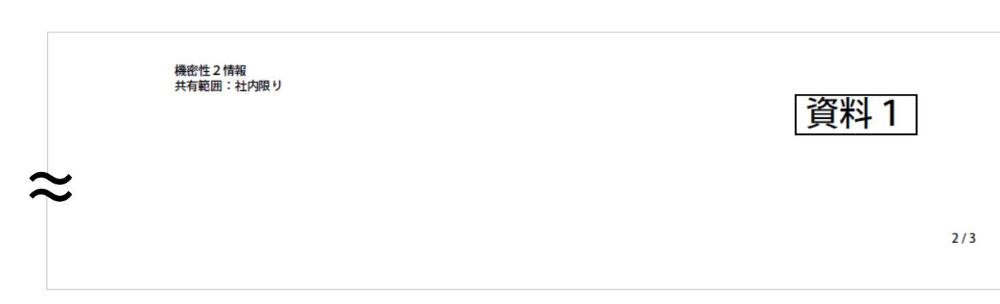

Watashiwa Kaigi Skisky
======================
Folder Level Script File of Adobe Acrobat DC for the purpuse of formatting KAIGI (meeting) documents. This script has been made according to Japanese bizarre KAIGI customs, and thus written in Japanese version only.

## License

This project is licensed under either of

* [Apache License, Version 2.0](https://www.apache.org/licenses/LICENSE-2.0)
  ([LICENSE-APACHE](LICENSE-APACHE))

* [MIT License](https://opensource.org/licenses/MIT)
  ([LICENSE-MIT](LICENSE-MIT))

at your option.

## 使用例

## 使い方

### 事前設定

### ページ番号付番

### 機密性付与

### 資料番号付番

### 資料番号付番

